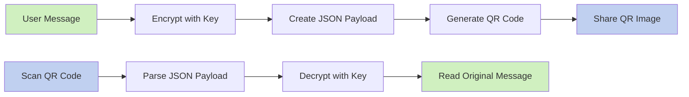
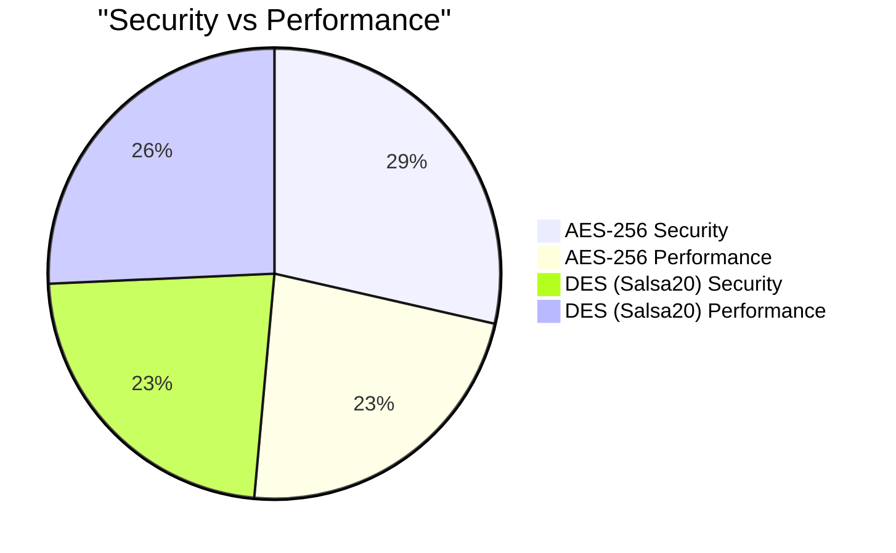
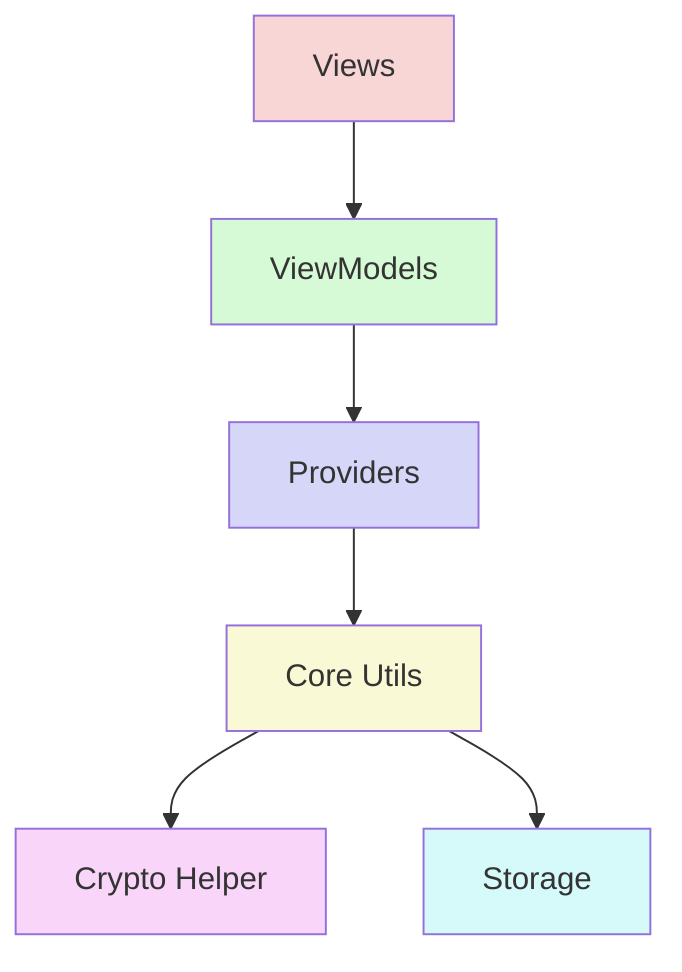
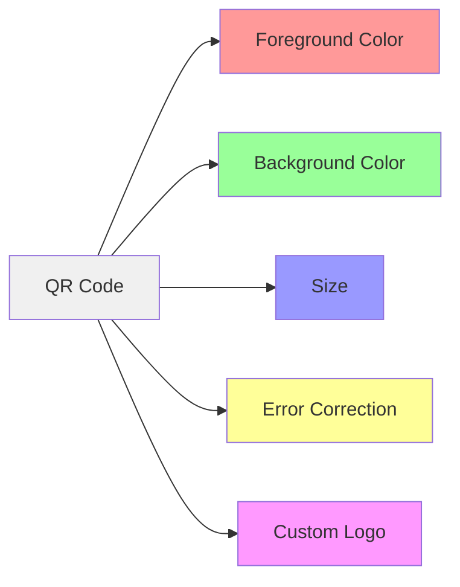

# Encrypted QR Generator

A secure Flutter application for creating, customizing, and sharing encrypted QR codes. This app allows you to encrypt messages using industry-standard encryption algorithms and convert them into customizable QR codes that can be scanned and decrypted only by those with the correct key.

## Features

### Encryption & Security

- **Strong Encryption**: AES-256 and DES (Salsa20) algorithms
- **Secure Key Management**: Private keys never leave your device
- **End-to-End Security**: Only the intended recipient with the correct key can decrypt messages

### QR Code Generation & Customization

- **Custom QR Styling**: Customize colors, size, and error correction levels
- **Logo Embedding**: Add your own logo to the center of QR codes
- **High Quality Export**: Generate high-resolution QR codes for sharing

### User Experience

- **Intuitive Interface**: Clean, modern UI with smooth animations
- **Dark Mode Support**: Toggle between light and dark themes
- **Responsive Design**: Works on all mobile device sizes

### Sharing & Scanning

- **Direct QR Scanning**: Scan encrypted QR codes using your device camera
- **Image Sharing**: Share QR codes as high-quality images
- **Multi-Format Sharing**: Share decrypted text as text or images

## Visualizations

### Encryption Workflow



### Encryption Algorithms Comparison



### App Architecture



### QR Customization Options



## Screenshots

[Placeholder for app screenshots - Add screenshots of your app here]

## Getting Started

### Prerequisites

- Flutter 3.0.0 or higher
- Dart 2.17.0 or higher
- Android Studio / VS Code with Flutter extensions

### Installation

1. Clone the repository:

```bash
git clone https://github.com/ahmedtohamy1/encrypted_qr_generator.git
cd encrypted_qr_generator
```

2. Install dependencies:

```bash
flutter pub get
```

3. Run the app:

```bash
flutter run
```

## Usage

### Encrypting a Message

1. Navigate to the **Encrypt** tab
2. Enter your message in the text field
3. Select an encryption algorithm (AES or DES)
4. Enter a secret key
5. Tap "Encrypt & Generate QR"
6. Customize your QR code using the style button
7. Share the generated QR code as an image

### Decrypting a Message

1. Navigate to the **Decrypt** tab
2. Scan a QR code using your device camera
3. Enter the secret key
4. Tap "Decrypt"
5. View the decrypted message
6. Share or copy the decrypted text as needed

## Technical Details

This app is built using:

- **Flutter**: For cross-platform mobile development
- **Riverpod**: For state management
- **Encrypt**: For cryptographic operations
- **QR Flutter**: For QR code generation
- **QR Code Scanner Plus**: For QR code scanning

The architecture follows a clean pattern with:

- **Models**: For data representation
- **Providers**: For state management
- **Views**: For UI components
- **Utils**: For utility functions like encryption/decryption

## Privacy

Your data never leaves your device. All encryption and decryption operations are performed locally.

## License

This project is licensed under the MIT License - see the LICENSE file for details.

## Acknowledgments

- [Flutter](https://flutter.dev)
- [Riverpod](https://riverpod.dev)
- [Encrypt Package](https://pub.dev/packages/encrypt)
- [QR Flutter](https://pub.dev/packages/qr_flutter)
