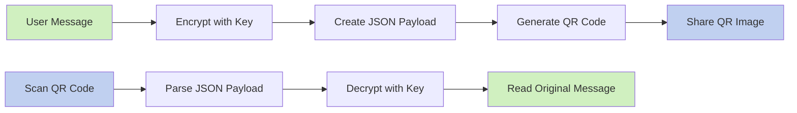
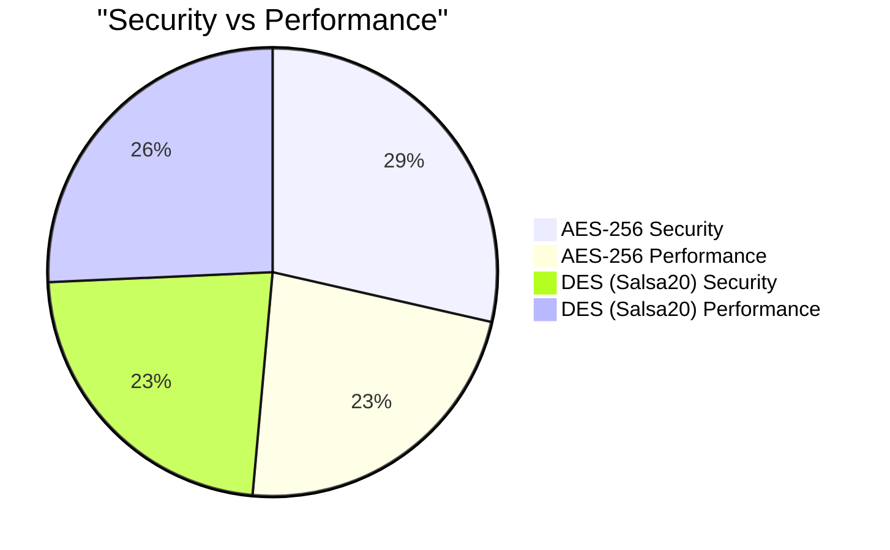
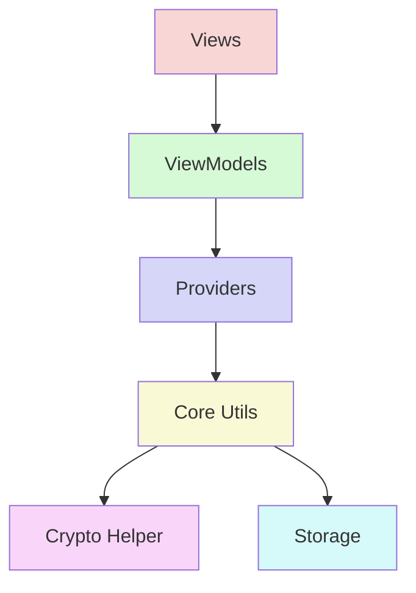
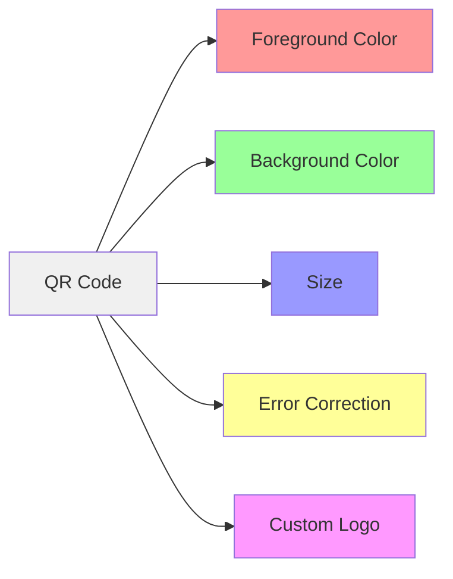

# Encrypted QR Generator

A secure Flutter application for creating, customizing, and sharing encrypted QR codes. This app allows you to encrypt messages using industry-standard encryption algorithms and convert them into customizable QR codes that can be scanned and decrypted only by those with the correct key.

## Features

### Encryption & Security

- **Strong Encryption**: AES-256 and DES (Salsa20) algorithms
- **Secure Key Management**: Private keys never leave your device
- **End-to-End Security**: Only the intended recipient with the correct key can decrypt messages

### QR Code Generation & Customization

- **Custom QR Styling**: Customize colors, size, and error correction levels
- **Logo Embedding**: Add your own logo to the center of QR codes
- **High Quality Export**: Generate high-resolution QR codes for sharing

### User Experience

- **Intuitive Interface**: Clean, modern UI with smooth animations
- **Dark Mode Support**: Toggle between light and dark themes
- **Responsive Design**: Works on all mobile device sizes

### Sharing & Scanning

- **Direct QR Scanning**: Scan encrypted QR codes using your device camera
- **Gallery Image Scanning**: Scan QR codes from saved images in your gallery
- **Image Sharing**: Share QR codes as high-quality images
- **Multi-Format Sharing**: Share decrypted text as text or images

## Visualizations

### Encryption Workflow



### Encryption Algorithms Comparison



### App Architecture



### QR Customization Options



## Detailed Encryption Implementation

### AES-256 Encryption

#### Encryption Process

1. **Key Preparation**:

   - Takes the user-provided key of any length
   - Pads or truncates the key to exactly 32 bytes (256 bits) using padding with '0' characters
   - Example: Key "password" becomes "password000000000000000000000000"

2. **Initialization Vector (IV)**:

   - Generates a random 16-byte (128-bit) initialization vector
   - Ensures each encryption produces different ciphertext even with the same key and plaintext
   - Critical for security to prevent pattern recognition attacks

3. **Encryption Algorithm**:

   - Uses the AES (Advanced Encryption Standard) in CBC mode
   - Processes the plaintext in 128-bit blocks
   - Each block is XORed with the previous ciphertext block (or IV for first block)
   - The result is then transformed using multiple substitution and permutation rounds

4. **Result Packaging**:
   - Converts the encrypted bytes to Base64 format for safe text representation
   - Creates a JSON structure containing two fields:
     ```json
     {
       "iv": "base64EncodedInitializationVector",
       "encrypted": "base64EncodedEncryptedData"
     }
     ```
   - JSON-encodes this structure to create the final output string

#### Decryption Process

1. **Input Parsing**:

   - Parses the JSON string to extract the IV and encrypted data components
   - Decodes the Base64-encoded IV and encrypted data back to bytes

2. **Key Reconstruction**:

   - Processes the provided decryption key exactly as during encryption
   - Pads or truncates to 32 bytes (256 bits)

3. **Decryption Algorithm**:

   - Initializes AES-256 decryptor with the padded key
   - Uses the extracted IV to set the initial state
   - Reverses the encryption process: applies inverse substitutions and permutations
   - Reverses the XOR operations with previous blocks

4. **Error Handling**:
   - Implements comprehensive try-catch error handling
   - Returns null if any stage of decryption fails (JSON parsing, Base64 decoding, decryption)
   - Common failures: incorrect key, tampered data, invalid format

### DES (Salsa20) Implementation

#### Encryption Process

1. **Key Preparation**:

   - Takes the user-provided key of any length
   - Pads or truncates to exactly 32 bytes (256 bits)
   - Note: Though labeled "DES" for user simplicity, actually uses Salsa20 algorithm which requires 256-bit keys

2. **Initialization Vector (IV)**:

   - Generates a smaller 8-byte (64-bit) IV, sufficient for Salsa20's security properties
   - Cryptographically random to ensure unique encryption results

3. **Encryption Algorithm**:

   - Uses Salsa20 stream cipher instead of traditional DES
   - Salsa20 creates a keystream based on the key and IV
   - The plaintext is XORed with this keystream to produce ciphertext
   - Chosen for superior security and performance over original DES

4. **Result Packaging**:
   - Identical structure to AES: Base64-encoded data in a JSON envelope
     ```json
     {
       "iv": "base64EncodedInitializationVector",
       "encrypted": "base64EncodedEncryptedData"
     }
     ```
   - This consistent format allows the app to handle both algorithms uniformly

#### Decryption Process

1. **Input Parsing**:

   - Same as AES: parses JSON and extracts Base64-encoded components

2. **Key Reconstruction**:

   - Pads/truncates the key to 32 bytes (256 bits) for Salsa20
   - Must match exactly what was used during encryption

3. **Decryption Algorithm**:

   - Reconstructs the Salsa20 keystream using the key and stored IV
   - XORs the ciphertext with this identical keystream to recover plaintext
   - The XOR operation is its own inverse, which is why the same operation works for both encryption and decryption

4. **Error Handling**:
   - Identical robust error handling as with AES
   - Ensures graceful failure without app crashes
   - Returns null when decryption fails for any reason

### Algorithm Selection Considerations

- **AES-256**: Higher security standard, widely tested, slightly more processing intensive
- **Salsa20 (labeled as DES)**: Excellent performance, strong security, lightweight algorithm
- Both implementations use industry-standard encryption packages with proper IV handling and key management

### Security Measures

- IVs are never reused across encryptions
- Keys never leave the device
- All cryptographic operations happen locally
- Encrypted data contains no hints about the original content
- JSON structure preserves all necessary information for proper decryption

## Getting Started

### Prerequisites

- Flutter 3.0.0 or higher
- Dart 2.17.0 or higher
- Android Studio / VS Code with Flutter extensions

### Installation

1. Clone the repository:

```bash
git clone https://github.com/ahmedtohamy1/encrypted_qr_generator.git
cd encrypted_qr_generator
```

2. Install dependencies:

```bash
flutter pub get
```

3. Run the app:

```bash
flutter run
```

## Usage

### Encrypting a Message

1. Navigate to the **Encrypt** tab
2. Enter your message in the text field
3. Select an encryption algorithm (AES or DES)
4. Enter a secret key
5. Tap "Encrypt & Generate QR"
6. Customize your QR code using the style button
7. Share the generated QR code as an image

### Decrypting a Message

1. Navigate to the **Decrypt** tab
2. Scan a QR code using your device camera
3. Enter the secret key
4. Tap "Decrypt"
5. View the decrypted message
6. Share or copy the decrypted text as needed

## Technical Details

This app is built using:

- **Flutter**: For cross-platform mobile development
- **Riverpod**: For state management
- **Encrypt**: For cryptographic operations
- **QR Flutter**: For QR code generation
- **QR Code Scanner Plus**: For QR code scanning

The architecture follows a clean pattern with:

- **Models**: For data representation
- **Providers**: For state management
- **Views**: For UI components
- **Utils**: For utility functions like encryption/decryption

## Privacy

Your data never leaves your device. All encryption and decryption operations are performed locally.

## License

This project is licensed under the MIT License - see the LICENSE file for details.

## Acknowledgments

- [Flutter](https://flutter.dev)
- [Riverpod](https://riverpod.dev)
- [Encrypt Package](https://pub.dev/packages/encrypt)
- [QR Flutter](https://pub.dev/packages/qr_flutter)
